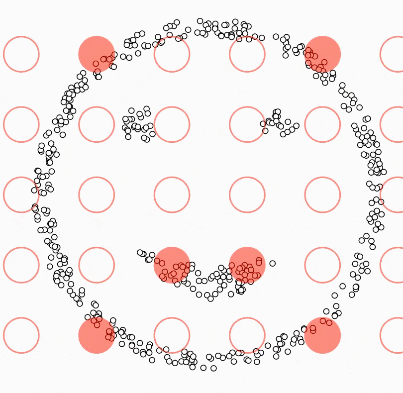
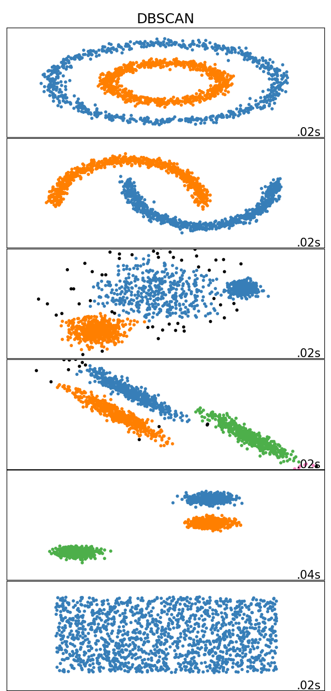

# Density-Based Spatial Clustering of Applications with Noise (DBSCAN)

DBSCAN (Density-Based Spatial Clustering of Applications with Noise) views clusters as areas of high density separated by areas of low density ([Density-Based Clustering](https://link.springer.com/referenceworkentry/10.1007%2F978-0-387-30164-8_211#:~:text=Density%2DBased%20Clustering%20refers%20to,regions%20of%20low%20point%20density.)). Due to this rather generic view, DBSCAN can find clusters of any shape, as opposed to an algorithm like [K-Means](https://ml-explained.com/blog/kmeans-explained), that minimizes the within-cluster sum-of-squares, which works best for convex shapes. Furthermore, DBSCAN figures out the number of clusters automatically.

## DBSCAN Theory

The central component of DBSCAN is the concept of *core samples*. Core Samples are data points that have at least `minPts` other data points within a distance of `eps`, which are defined as neighbors of the core sample. The fact that the core samples have at least `minPts` in some distance `eps` tells us that the core samples are in a dense area of the vector space. 

A cluster is a set of core samples that can be built by recursively taking a core sample, finding all neighbors that are also core samples, and then finding their neighboring core samples, and so on. A cluster also has a set of non-core samples, which are samples that are neighbors of a core sample in the cluster but are not themselves core samples. Intuitively, these samples are on the edge of a cluster; therefore, they are often called *border samples* or *border points*.

Lastly, there is also a third kind of samples - *noise samples* or *outliers*. These are points that are at least `eps` distance from any core sample.

In the below video, you can see what the above steps look like:

## [Parameter Estimation](https://en.wikipedia.org/wiki/DBSCAN#Parameter_estimation)

As shown above, DBSCAN has two parameters `eps` and `minPts`.
* `minPts`: The number of points that need to be next to a point for this point to be considered a *core sample*. It primarily controls how tolerant the algorithm is towards noise (on noisy and large data sets, it may be desirable to increase this parameter)
* `eps`: The max distance for two points to be considered neighbors.

Choosing the wrong values for these two parameters can lead to all points being in one single cluster or all points being classified as outliers/noise. Therefore it's a good idea not to choose these parameters randomly. Instead, I'll show you some rules of thumb:
* `minPts`: As a rule of thumb, a minimum minPts can be derived from the number of dimensions D in the data set, as minPts ≥ D + 1. A value of 1 makes no sense because then every point on its own will already be a cluster. If minPts is <= 2, the result will be the same as of hierarchical clustering with the single link metric, with the dendrogram cut at height ε. Therefore, minPts must be at least 3. However, larger values are usually better for data sets with noise and will yield more significant clusters.
* `eps`: The value for eps can then be chosen using a [k-distance graph](https://en.wikipedia.org/wiki/Nearest_neighbor_graph), plotting the distance to the k = minPts-1 nearest neighbor ordered from the largest to the smallest value. Good values of eps are where this plot shows an "elbow":

## Advantages

* DBSCAN does not require one to specify the number of clusters beforehand.
* DBSCAN performs well with arbitrary shaped clusters.
* DBSCAN has a notion of noise, and is robust to [outliers](https://en.wikipedia.org/wiki/Anomaly_detection).

## Disadvantages

* DBSCAN cannot cluster data-sets with large differences in densities well, since then the minPts-eps combination cannot be chosen appropriately for all clusters.
* Choosing a meaningful eps value can be difficult if the data isn't well understood.
* DBSCAN is not entirely deterministic. That's because the algorithm starts with a random point. Therefore border points that are reachable from more than one cluster can be part of either cluster.

## Results

Results on [toy data-sets](https://scikit-learn.org/stable/auto_examples/cluster/plot_cluster_comparison.html):

## Code

* [DBSCAN from Scratch in Python](code/dbscan.py)

## Credit / Other resources

* https://en.wikipedia.org/wiki/DBSCAN
* https://scikit-learn.org/stable/modules/clustering.html#dbscan
* https://www.naftaliharris.com/blog/visualizing-dbscan-clustering/